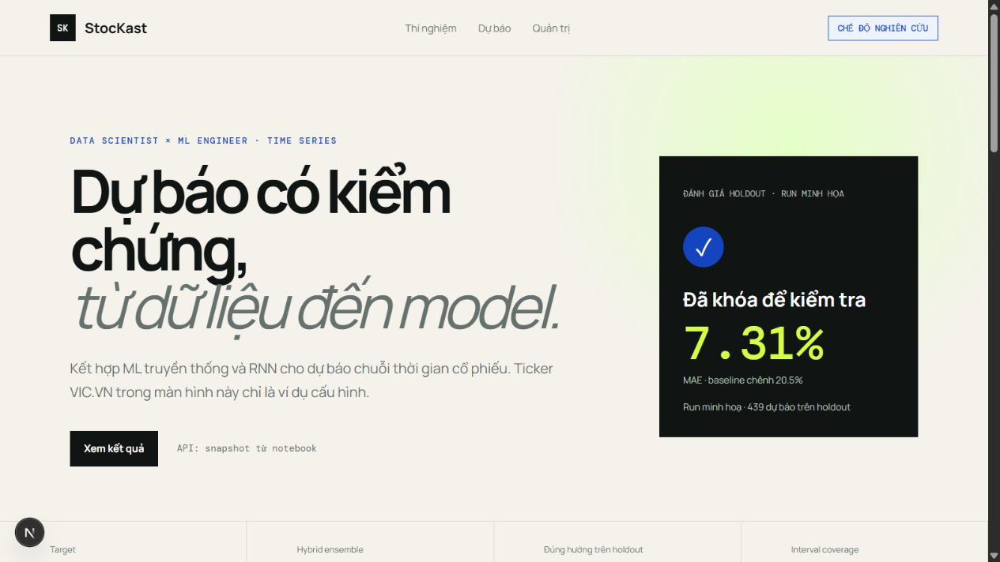
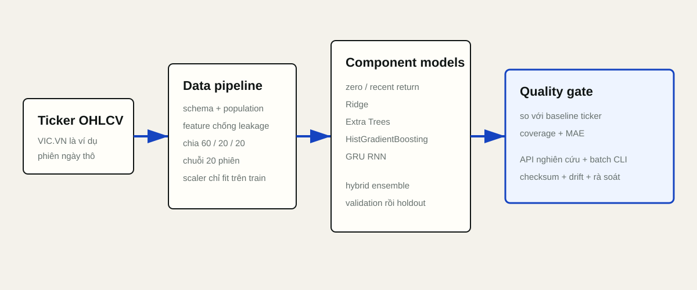

# StocKast — Framework dự báo chuỗi thời gian cổ phiếu

> Framework Data Scientist và ML Engineer cho dự báo chuỗi thời gian cổ phiếu, kết hợp ML truyền thống với RNN trên một pipeline có frozen holdout và quality gate minh bạch.


[](https://github.com/lqb464/StocKast/actions/workflows/ci.yml)



## Phạm vi hiện tại

StocKast là framework nghiên cứu cho bài toán dự báo stock time-series nói chung. VIC là ticker ví dụ được dùng để chạy end-to-end pipeline; candidate được chọn trên validation là GRU, còn hybrid ensemble được benchmark như một phương án kết hợp. Các metric trong repository là output của run minh họa và cần được tái lập khi đổi ticker hoặc universe.

Run minh họa có frozen holdout để kiểm tra chất lượng và minh họa cơ chế quality gate; đây không phải trạng thái cố định của framework hay kết luận cho mọi ticker. Project đóng gói artifact, serving path và quy trình để team thay ticker, chạy lại experiment, so sánh component rồi tự quyết định promotion; không có chức năng tự động giao dịch hay khuyến nghị đầu tư. Số liệu nằm trong [`03_Model_Experiments.ipynb`](notebooks/03_Model_Experiments.ipynb), [`05_Business_Report.ipynb`](notebooks/05_Business_Report.ipynb) và [`production_report.json`](evaluation/production_report.json).

## Định nghĩa bài toán nghiệp vụ

- Dự báo cumulative log-return từ close ngày `t` đến close `t+5`, sau khi thị trường đóng cửa.
- Một dòng là một phiên giao dịch của ticker đang cấu hình; run mặc định dùng `VIC.VN` làm ví dụ provider.
- Output hỗ trợ nghiên cứu scenario, error analysis và model monitoring; không phải price target hoặc trading signal.
- Overprediction có thể tạo long exposure không cần thiết, nên theo dõi directional false positive bên cạnh MAE.
- Date/ticker ID và mọi thông tin sau ngày dự báo bị loại khỏi production matrix.

## Thiết kế thí nghiệm và hybrid ensemble

| Model | MAE trên validation | Nhóm |
|---|---:|---|
| Hybrid ensemble (RNN + ML truyền thống) | 0,03071 | Ensemble |
| GRU, window 20 | 0,02996 | RNN |
| Zero return | 0,02999 | Baseline nghiệp vụ |
| Ridge | 0,03092 | ML truyền thống |
| Extra Trees | 0,03118 | ML truyền thống |
| Histogram Gradient Boosting | 0,03374 | ML truyền thống |
| Return 5 ngày gần nhất | 0,04065 | Baseline thống kê |

Ridge, Extra Trees và Histogram Gradient Boosting được kiểm tra bằng expanding-window cross-validation với gap 5 phiên. Hybrid ensemble kết hợp các component cùng dự báo một target; model selection vẫn được khóa bằng validation MAE trước khi holdout được mở. Kết quả holdout chỉ quyết định promotion gate, không được dùng để tune lại.



## Các notebook

1. `01_EDA.ipynb`: business framing, population/schema audit, target distribution và outlier cho ticker ví dụ.
2. `02_Feature_Engineering.ipynb`: leakage-safe features, multicollinearity và chronological split.
3. `03_Model_Experiments.ipynb`: baselines, ML truyền thống, GRU, hybrid ensemble, CV, validation selection và frozen holdout.
4. `04_Model_Interpretation.ipynb`: permutation importance, error bands và volatility regimes.
5. `05_Business_Report.ipynb`: validation-calibrated interval, manual review, quality gate và monitoring.

Tất cả notebook đã được chạy tuần tự, có execution count và không có error output.

## Khởi chạy nhanh

```bash
python -m venv .venv
.venv/Scripts/activate
pip install -e ".[dev,api,notebooks]"
python scripts/download_data.py --ticker VIC --output data/raw/VIC_VN.csv
python scripts/run_notebooks.py
python scripts/train.py
python scripts/batch_predict.py
```

Chạy API và dashboard:

```bash
python -m uvicorn backend.main:app --reload --port 8000
npm install --prefix frontend
npm run dev --prefix frontend
```

- Dashboard: `http://localhost:3000`
- OpenAPI: `http://localhost:8000/docs`
- Model metadata: `GET /api/model`
- Raw/batch prediction: `POST /api/predict`

Hoặc dùng `docker compose up --build` sau khi artifact local đã được train.

## Pipeline và artifact

Một đường `raw OHLCV → schema → feature frame → train-only scaler → component models (ML truyền thống + RNN) → hybrid ensemble → cap/warning/review` được dùng chung cho batch CLI và API. Artifact chứa model state, traditional components, scaler, feature contract, version, holdout metrics, calibration, reference statistics và deployment status; file metadata đi kèm lưu SHA-256 để kiểm tra roundtrip.

CLI chính:

```bash
python scripts/validate_data.py
python scripts/train.py --smoke-test
python scripts/batch_predict.py --input data/raw/VIC_VN.csv
python scripts/monitor.py --input data/raw/VIC_VN.csv
```

## Kiểm thử và khả năng tái lập

```bash
pytest
npm run build --prefix frontend
docker compose config
```

Test bao phủ schema/population, sentinel và numeric string lỗi, feature leakage/infinity, sequence length, artifact checksum roundtrip, quality gate nghiệp vụ, raw-to-prediction cùng các endpoint health/model/predict của API.

## Giới hạn

- Kết quả trên ticker ví dụ không chứng minh khả năng tổng quát; mỗi ticker hoặc universe cần một run dữ liệu và holdout riêng.
- Technical OHLCV không có fundamentals, corporate actions context hoặc event labels.
- Interval hiện là residual interval calibration trên validation và đã mất coverage ở holdout.
- Backtest hoặc forecast lịch sử không chứng minh lợi nhuận tương lai.
- Hybrid ensemble cần data/model redesign, đánh giá nhiều ticker và một holdout mới chưa từng dùng trước khi có thể promote.

Chi tiết chính sách tại [`MODEL_GOVERNANCE.md`](docs/MODEL_GOVERNANCE.md) và model card tại [`MODEL_CARD.md`](training/MODEL_CARD.md).
